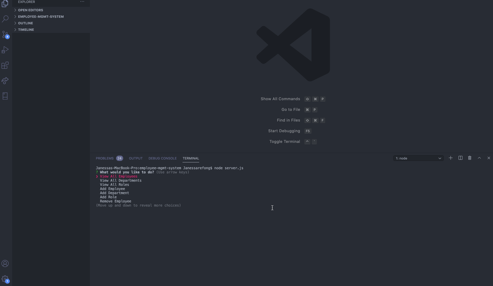
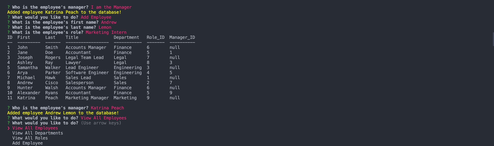

# Employee Tracker (employee-mgmt-system)

In this project, I created an employee tracker that allows users to view, store and remove information from a database where they can manage their employees. The application allows the user to do the following actions: 1) add employees, roles and departments, 2) view employees, roles and departments, 3) update the roles of the employees, and 4) remove employees, roles and departments. 

The user will be prompted questions using node and I have used the Inquirer package for those prompts as well as MySQL where the information will be stored into a database.

This was a challenging project because there are so many things to consider and I felt I could've done more and finish all the bonus points if I was given more time however, I was able to complete the basic functionality. I was challenged on pulling information from the database from different tables and did a ton of trial and errors to get the responses. I did something different, I've realized as a user, when adding a new employee with the employee's first name, last name, role and manager, I have realized that the managers names are not enough information as a user to let me know what department the manager is from and so when prompted "Who is the employee's manager?", I display a table with the list of employees and departments so that the user can use it as a reference that as an Accoutant, the new employee should be under the Accounts Manager in the accounting department. I wanted the user's experience to be easier in that way.

## Table of Contents

* [Technologies Used](#technologies-used)
* [GIF of Project](#gif-of-project)
* [Image of Project](#image-of-project)
* [Code Snippet](#code-snippet)
* [Authors](#authors)
* [License](#license)
* [Acknowledgments](#acknowledgments)

## Technologies Used

* [Node.js](https://nodejs.org/en/)
* [Javascript](https://developer.mozilla.org/en-US/docs/Web/JavaScript)
* [jquery](https://jquery.com/)
* [MySQL](https://www.mysql.com/)
* [Inquirer](https://www.npmjs.com/package/inquirer)
* [Chalk](https://www.npmjs.com/package/chalk)


## GIF of Project



## Images of Project

Attached below is a picture of the application at the main page and the notes page.



## Code Snippet
  
  I chose this code snippet because with the query, I am able to pull information from the database to set the choices for the user and pushing those values into empty arrays and I even use the first and last name of the employee. And in my .then function, I needed to split the first name and last name so that I can update the role of the employee that way, otherwise if I only used the first name, there could be multiple people with the same first name so this helps really set the updated role to a specific employee.

```
// function that updates the role of the employees
function updateRole() {
    connection.query("SELECT first_name AS First, last_name AS Last, title AS Title, role_id AS Role_ID FROM employees LEFT JOIN roles ON employees.role_id = roles.id", function(err, res) {
        if (err) throw err;
        console.table(res);

 // prompts the user a list to select an employee to and select the role while being displayed the table as a reference guide
        inquirer.prompt([{
                type: "list",
                name: "employee",
                message: "Select an employee to update role",
                choices: function() {
                    let employeeArray = [];
                    for (let i = 0; i < res.length; i++) {
                        employeeArray.push(`${res[i].First} ${res[i].Last}`);
                    };
                    return employeeArray;
                },
            },
            {
                type: "list",
                name: "updaterole",
                message: "Select the role",
                choices: function() {
                    let roleArray = [];
                    for (let i = 0; i < res.length; i++) {
                        roleArray.push(res[i].Title);
                    };
                    return roleArray;
                },
            },
        ]).then((data) => {
            // the employee information set into a variable and splitting the first and last name
            let name = data.employee.split(" ");

            // setting the variables from the name variable holding an array of the first and last name
            let employeefirstName = name[0];
            let employeelastName = name[1];

            // variable to grab the role id
            let updateroleId;
            for (let i = 0; i < res.length; i++) {
                if (res[i].Title === data.updaterole) {
                    updateroleId = res[i].Role_ID;
                };
            };
```

## Authors

* Janessa Reeanne Fong

- [Link to Github](https://github.com/janessaref)
- [Link to LinkedIn](https://www.linkedin.com/in/janessafong)

## License

This project is licensed under the MIT License 

## Acknowledgments

* I'd like to acknowledge Andrew Knapp, my tutor who has helped me with the employees table as a starter.
* I'd like to also acknowledge my instructors and TAs, Roger Lee, Kerwin Hy and Manuel Nunes that helped me towards accomplishing this project.

